## 1. Introduction

Dravo!! ("Driving" + "Bravo") is a full-stack web application designed to digitalise the administrative workflow for driving instructors. It integrates student portfolios, lesson scheduling, note-taking, and finance management into one system, replacing traditional paper records. The app also features an AI coach that retrieves information directly from an instructor's own lesson notes to provide instant, personalised insights on student progress. Empower your teaching and help your students achieve that first-time pass with Dravo!!

## 2. Features

**Login & Register**

<p align="center">
  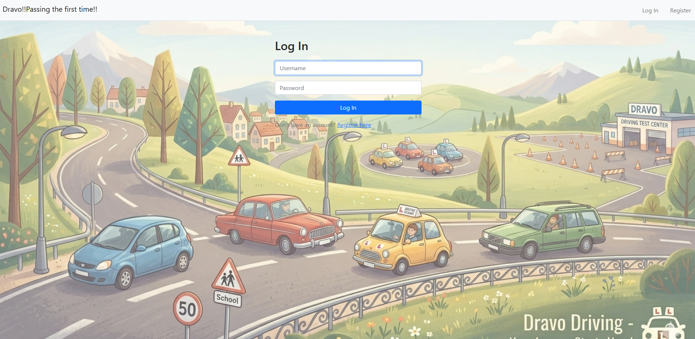
  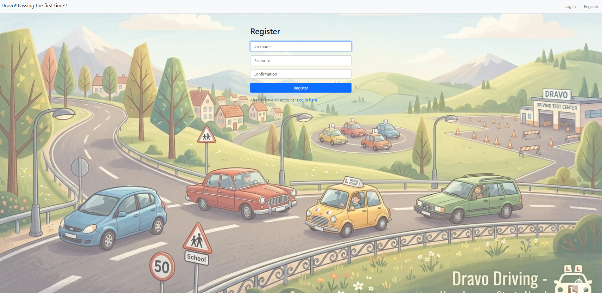
</p>

**Dashboard** — Provides a high-level overview of the teaching business. Features include interactive student tiles for quick access to portfolios, a donut chart visualizing monthly revenue by student contribution, and a weekly lesson schedule outlook for a quick skim of upcoming commitments. Navigation links are integrated throughout the dashboard, providing direct access to detailed pages for the full schedule, finance management, and student portfolio evaluations.

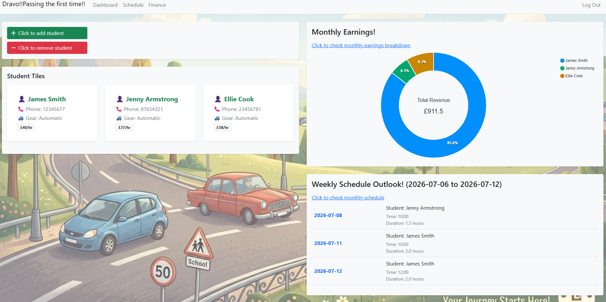

Students are added and soft-deleted through modal pop-ups directly on this page:

<p align="center">
  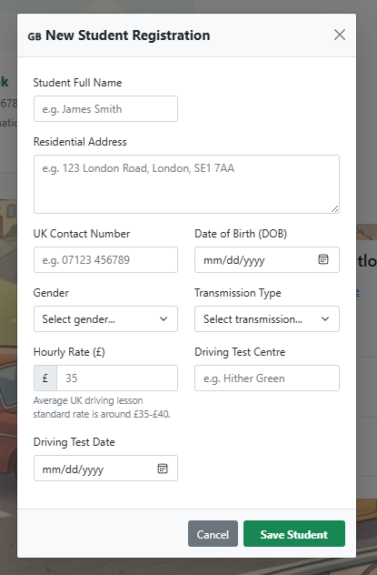
  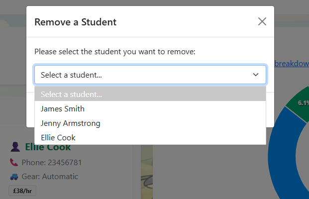
</p>

**Schedule** — A centralized calendar view that fetches lesson data live from the database, providing a clear picture of upcoming availability.

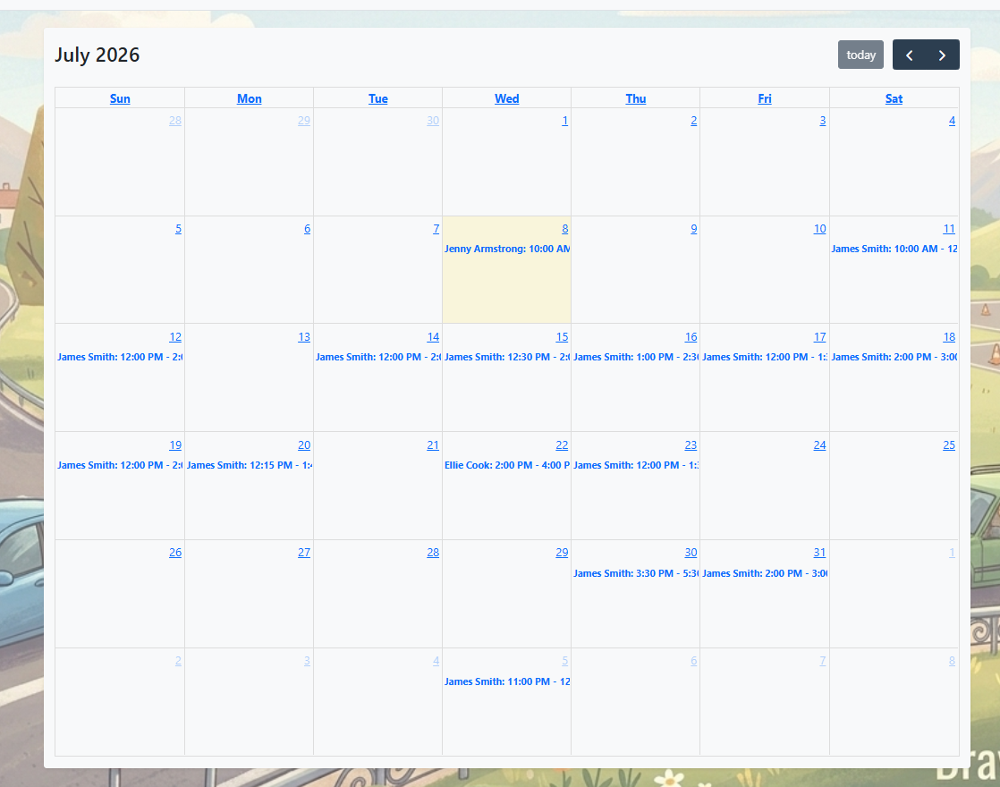

**Finance** — A comprehensive ledger that tracks every lesson, payment status, and individual earning, ensuring financial records remain accurate and up to date.

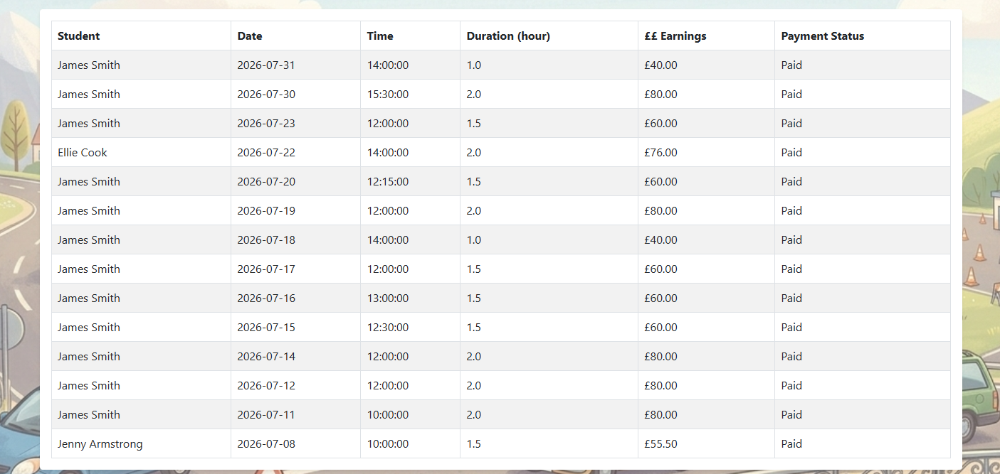

**Student Portfolio** — A detailed profile for each student, displaying personal information alongside a full lesson history. Lessons are added via modal pop-ups; upon submission, the application utilizes AJAX (via fetch()) to instantly append the new lesson to the lessons table, while simultaneously creating a corresponding entry in the progress notes table. These notes are then automatically saved via a blur() event, providing a fluid, responsive experience that keeps the workflow moving without interruption.

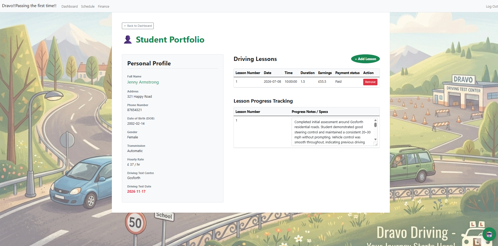

**AI Driving Coach** — An intelligent assistant (chatbot) that analyses personal lesson notes to answer specific questions about a student's progress. It provides grounded, data-driven feedback, helping instructors in identifying areas for improvement and guiding students toward a first-time pass.

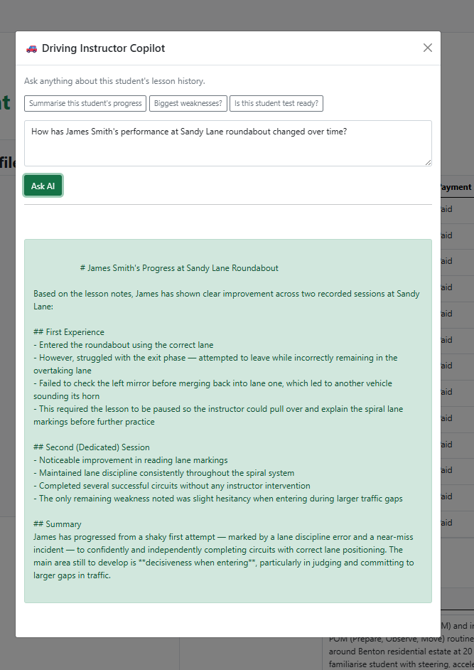


## 3. Tech Stack
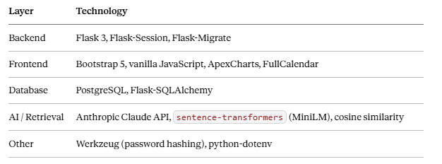


## 4. Design Decisions

**Frontend: Prioritizing Workflow Efficiency**

Standard web applications often rely on full-page reloads for data updates, which can disrupt a user's flow. Since logging lessons and notes are high-frequency tasks, a full reload was identified as a major bottleneck. To streamline this, the application replaces standard form submissions with AJAX (via fetch()). Lessons are added via modal pop-ups and appended to the table instantly without page refreshes. Furthermore, progress notes utilize blur() events to enable "auto-saving," removing the need for a manual "Save" button. This ensures the instructor never loses their place mid-task.

**Backend: Ensuring Data Integrity and Security**

To prevent common web vulnerabilities like accidental duplicate submissions, the backend implements the Post-Redirect-GET (PRG) pattern. Every data-modifying operation redirects the browser upon completion, ensuring that page refreshes do not inadvertently re-trigger form submissions. For security, multi-tenancy is implemented at the query level: rather than relying solely on session-based login, every database query is scoped to the instructor_id of the currently authenticated user. This ensures that instructor data remains isolated and secure by design.

**Database: Scaling for Reliability**

The project began with SQLite to prioritize speed during the initial schema prototyping phase. Once the data structure stabilized, the system migrated to PostgreSQL. This transition was critical to support stricter column typing and improved handling of concurrent connections, ensuring the application remains stable as simultaneous user activity increases.

**AI: Optimizing Retrieval for Performance**

To avoid high latency and unnecessary costs as student history expands, the AI Driving Coach avoids sending entire historical datasets to the model. Instead, it utilizes embedding similarity to retrieve only the five most relevant lesson notes. This "Retrieval-Augmented Generation" (RAG) approach keeps the AI's response time and API costs constant, regardless of whether a student has been enrolled for weeks or years.

**Security: Protecting Sensitive Information**

Security best practices are applied throughout the stack. Passwords are never stored in plain text; instead, they are hashed using Werkzeug security utilities. Furthermore, sensitive credentials—such as database URLs and API keys—are managed via environment variables using python-dotenv, preventing these secrets from being hardcoded or accidentally exposed in version control.

## 5. The AI Driving Coach

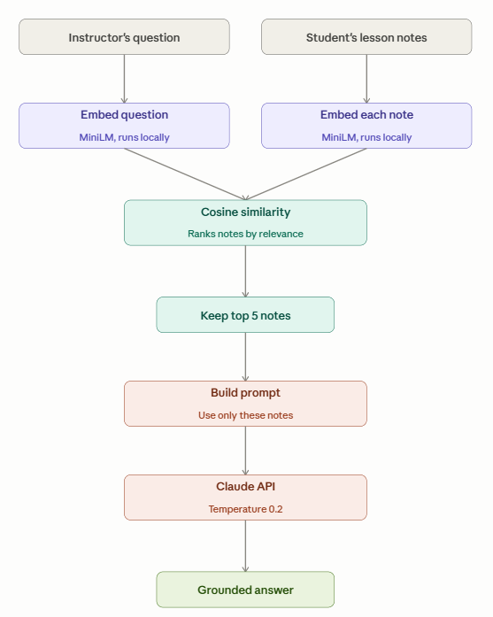

To maintain efficiency as student history scales, lesson notes and user queries are embedded locally using MiniLM and ranked via cosine similarity. Only the top five most relevant notes are included in the prompt, ensuring cost-effectiveness and context relevance. The system prompt is strictly constrained to "Use ONLY the lesson notes below," and the temperature is set to 0.2 to ensure factual, deterministic responses.

## 6. Database Schema

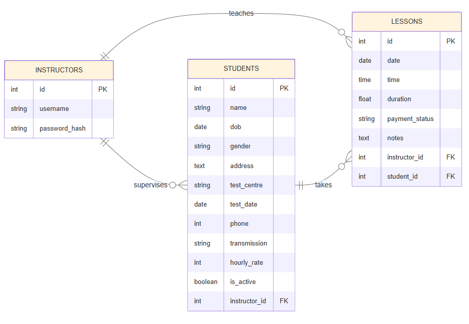

Earnings are computed at query time (`duration × hourly_rate`), never stored, so a rate change never rewrites history. Removing a student sets `is_active = False` rather than deleting the row.

## 7. User Feedback

The application was validated by a driving instructor. The primary pain point identified was reviewing handwritten notes to assess progress across a large student base. The AI Coach was specifically engineered to solve this, enabling rapid, data-driven insights into individual student development.

## 8. Key development learnings

**Non-blocking UI with fetch() and async/await:**
Integrating asynchronous JavaScript prevents UI blocking during network requests. By utilizing await for operations and wrapping calls in try/catch blocks, the application ensures that network latency or dropped connections trigger informative error states rather than silent failures.

**POST-Redirect-GET (PRG) Pattern:**
To eliminate duplicate data submissions, the application adheres to the PRG pattern. Because a browser refresh repeats the last actively sent request, redirecting the user after a POST operation ensures that a refresh triggers a safe GET request instead, preserving data integrity.

**Non-Destructive Schema Evolution:**
Initial reliance on db.create_all() proved unsuitable for production-ready development as it risks destructive table recreation. Migrating to Flask-Migrate allows for incremental, version-controlled schema modifications, ensuring that data remains intact during structural changes.

**Dependency and Environment Parity:**
Discrepancies between development environments were mitigated by standardizing on WSL (Ubuntu). Furthermore, strict adherence to venv and requirements.txt is essential to prevent version drift and ensure reproducible builds across different development cycles.

**Deterministic Query Ordering:**
Relational databases do not guarantee the order of returned rows unless explicitly instructed. This was identified when lesson notes appeared to shift positions randomly after page refreshes. The solution requires explicit declaration of retrieval order to ensure UI consistency:

  ```python
  Lesson.query.filter_by(student_id=student_id).order_by(Lesson.id).all()
  ```
This confirms that the UI reflects the actual sequence of events, as row order is not an inherent promise of the database layer.

## 9. Running locally

```bash
git clone <repo>
cd dravo
python -m venv venv && source venv/bin/activate
pip install -r requirements.txt

export DATABASE_URL="postgresql://<user>:<password>@localhost:5432/dravo"
echo "ANTHROPIC_API_KEY=sk-ant-..." > .env

python testclaude.py
python testembedding.py
python testrag.py

flask --app app run
```

Requires a local PostgreSQL instance with a `dravo` database created in advance.
